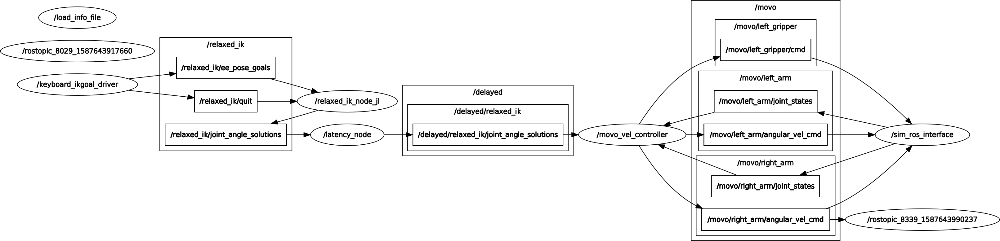

# Movo Control ROS Package

ROS Package and supplementary files for controlling a [Kinova Movo](https://www.kinovarobotics.com/sites/default/files/OP-03_2019-05_R01.pdf) robot. Improved version of [movo-control-2](). Adds better interaction with [movo-simulation]() and adds more Xbox control schemes.

# Contents
1. [Files Included](#1-files-included)
2. [Requirements](#2-requirements)
3. [Setup](#3-setup)
4. [Mimicry Control](#4-mimicry-control)
5. [Xbox Control](#5-xbox-control)
6. [Latency System](#6-latency-system)

# 1. Files included

* movo_mimicry - Movo mimicry control ROS package
    * Movo velocity control node
    * Movo xbox control files
    * Movo latency system files
    * Movo mimicry control files
* Config - Movo RelaxedIK Config files
* controller_publisher_dual.py - Mimicry control file

# 2. Requirements
* [RelaxedIK](https://github.com/uwgraphics/relaxed_ik) (julia version)
* mimicry_control ROS package
* [Movo description](https://github.com/Kinovarobotics/kinova-movo/tree/master/movo_common/movo_description)
* [Python Inputs](https://pypi.org/project/inputs/)

# 3. Setup
* Setup RelaxedIK with Movo using given [Config](./Config) file
* Add [controller_publisher_dual.py](./controller_publisher_dual.py) into *mimicry_control/src/bin*

# 4. Mimicry Control

Control both arms of the Movo and the base using Vive controllers.

## Usage

Connect an ethernet cable from the back of the
Movo to the Windows machine

### Linux (ROS):

Run / Launch the following ROS nodes -

`movo_mimicry.launch` : for 2 Vive controllers  
OR  
`movo_mimicry_single.launch` : for 1 Vive controller

### Windows (Unity):
1. Open vive-teleop-movo project
2. Set IP on broadcaster game object to `10.66.171.1`
3. Make sure one or both controllers are on and connected
4. Click play in Unity

# 5. Xbox Control

Control both arms of the Movo using an Xbox One controller. Go to [here]() for more information on control schemes and mappings.

## Usage

Run / Launch the following ROS nodes -

#### RelaxedIK nodes
* `load_info_file.py`
* `relaxed_ik_julia.launch`

#### Mimicry Control nodes
* `xbox_control.py`
* `xbox_to_ros.py`
* `movo_vel_controller.py`

# 6. Latency System

Add latency into the RelaxedIK Movo control system, used along with
[Movo simulation](https://github.com/joshuawisc/movo-sim-scene)
to mimic real life performance.

How the nodes interact (with a simulated Movo):

## Usage

Run / Launch the following ROS nodes -

#### RelaxedIK nodes
* `load_info_file.py`
* `relaxed_ik_julia.launch`

#### Mimicry Control nodes
* `movo_latency.launch`
